s# Kafka Fundamental

## Topics, partitions and offsetss
`Topics`

> a particular stream of data. Similar to a table in a database (without all constraints). Can have many topics as you wish. Identified by name

> topics are split in partitions, each partition is ordered. Each message in a partition gets an incremental id, called `offset`


  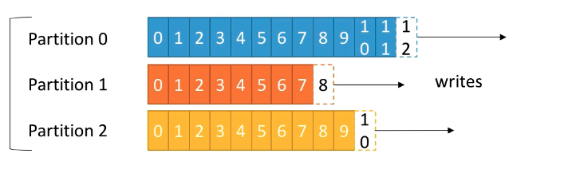

* `offset` only has a meaning for a specific partition.
  > Eg. offset 3 in partition 0 does not represent the same data as offset 3 in partition 1

* Order is guaranteed only within a partition (not across partitions)
* Data is kept only for a limited time (default is one week)
* Once the data is written to a partition, it can't be changed (immutability)
* Data is assigned randomly to a partition unless a key is provided

_use case_

>A trucking company has a fleet of trucks, each truck reports its GPS position to `Kafka`. In `Kafka` there is a topic named `trucks_gps` that contains the position of all trucks. Each truck will send a message to Kafka every 20 seconds, each message will contain the truck ID and the truck position (latitude and longitute). It can have 10 (arbitrary) partitions for this topic

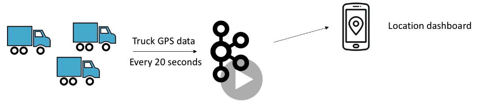

## Brokers

* A Kafka cluster is composed of multiple brokers (servers)
* Each broker is identified with its ID (integer)
* Each broker contains certain topic partitions
* After connecting to any broker (called bootstrap broker), you will be connected to the entire cluster
* A good number to get started is 3 brokers, but some big clusters have over 100 brokers
* In these examples we choose to number brokers starting at 100 (abritrary)

`Example`

Topic-A with 3 partitions and Topic-B with 2 partitions.
In case there are 2 brokers.
Possible partitions accross brokers are as below,

|Broker 101|Broker 102|Broker 103|
|--|--|--|
|Topic-A Partition 0|Topic-A Partition 2|Topic-A Partition 1|
|Topic-B Partition 1|Topic-B Partition 0||

## Topic replication factor
* Topics should have a replication factor > | (usually between 2 and 3)
* ThiS way if a broker down, another broker can serve the data
* Example, Topic-A with 2 partitions and replication factor of 2

|Broker 101|Broker 102|Broker 103|
|--|--|--|
|Topic-B Partition 1|Topic-B Partition 0||
||Topic-B Partition 1|Topic-B Partition 0|

## Concept of Leader for a Partition
* At any time only ONE broker can be a leader for a given partition
* Only that leader can receive and serve data for a partition
* The other brokers will synchronize the data
* Therefore each partition has one leader and multiple ISR (in-sync replica)

## Producers
* Poducers write data to topics (which is made of partitions)
* Producers automatically know to which broker and partition to write to
* In case of Broker failures, Producers will automatically recover
* Producers can choose to receive acknowledgement of data writes:
  
  
  **akcs=0**
  > Producer won't wait for acknowledgement (possible data lost).
  
  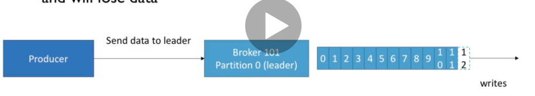
   
  > No response is requested. If the broker goes offline or an exception happens, 
  > we won't know and will lose data. 
  > Useful for data where it's okay tp potentially lose messages, such, `metrics collection`, `log collection`,etc
  

  **acks=1** (default, since kafka 0.1)
  > Leader response is requested, but replication is not guaranteed (happens in the background). 
  > Producer will wait for leader acknowledgement (limited data loss). If an ack is not received, the producer may retry
  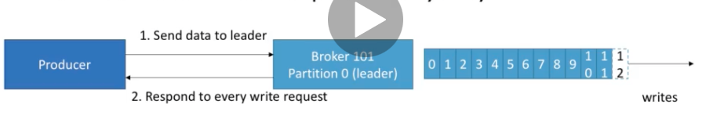
  > If the leader broker goes offline before but replicas have not replicated teh data may lose

  **acks=all** (replicas acks)
  > Leader + replicas aknowledgement (no data loss)
  > Add latency
  > No data loss if enough replicas

  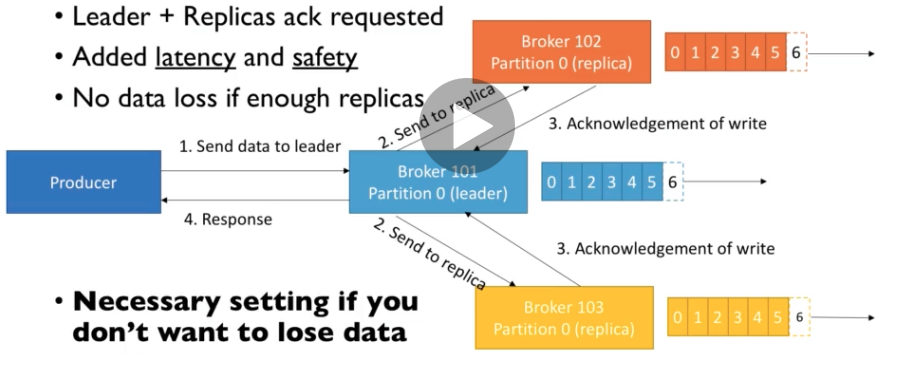
 
  > Necessary setting if you don't want to lose data
  > Must be used in conjunction with `min.insync.replicas`
  > `min.insync.replicas` can be set at the broker or topic level (override)
  > `min.insync.replicas=2` implies that least 2 brokers that are ISR (including replica) must respond that they have data.
  > That means if you use `replication.factor=3,min.insync=2,acks=all`, you can only tolerate 1 broker going down,
  > otherwise producer will receive an exception on send 
  
  `Example`
  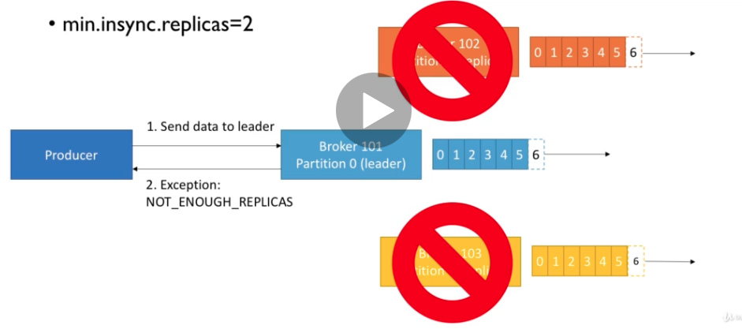

## Consumer Poll Behaviour
* Kafka Consumers have a `poll` model, while many other messaging bus in enterprises have `push` model.
* This allows consumers to control where in the log they want to consume, how fast, and gives them the ability to replay the events

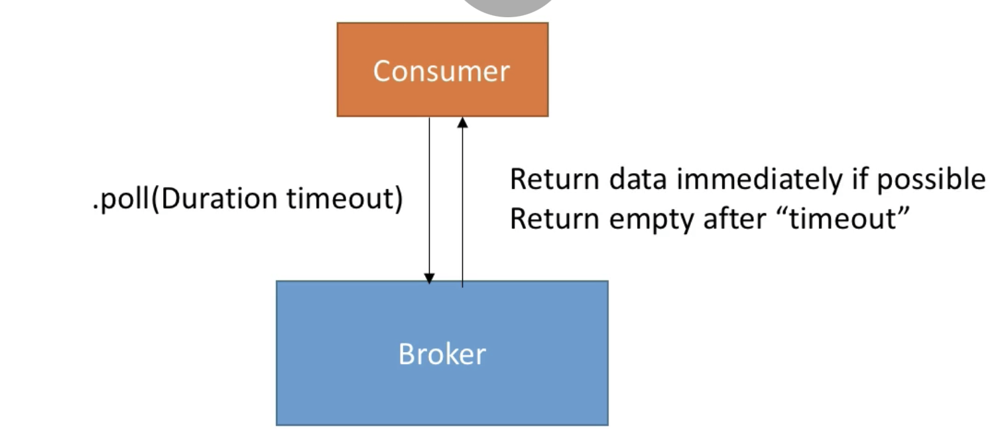

`fetch.min.bytes` (default 1)
* Controls how much data you want to pull at least on each request
* helps improving throughput and decreasing request number
* at the cost of latency

`max.poll.records` (default 500)

* Controls how many records to receive per poll request
* increase if your messages are very small and have a lot of available RAM
* Cood to monitor how many records are polled per request

`max.partitions.fetch.bytes` (default 1MB)

* Maximum data returned by broker per partition
* if you read from 100 partitions you will need a lot of memories (RAM)

`fetch.max.bytes` (defaulkt 50 MB)

* Maximum data returned for each fetch request (covers multiple partitions)
* the consumer performs multiple fetches in parallel

> Change these settings only if your consumer maxes out on throughput already

## Consumer Offset Commits Strategies
* (easy) enable.auto.commit=true and asynchrous processing of batches
```java
 while (true) {
        consumer.poll(Duration.ofMillis(100))
            .onSuccess(records -> records.records()
                .forEach(p ->
                    bufferHttpRequest.uri(buildUriWithId(p.value(), tweetySetting))
                        .sendJson(Json.decodeValue(p.value()))
                        .onSuccess(httpResponseHandler)
                        .onFailure(throwableHandler)
                ))
            .onFailure(throwable -> LOGGER.error("Failed processing", throwable));
      }

```
> With auto-commit, offsets will be committed automatically for you at a regular interval (`auto.commit.interval.ms=5000 by default`), every time you call `.poll`
> If you do not use synchronous processing, you will be in `at-most-once` behaviour because offsets will be committed before your data is processed
* (medium) enable.auto.commit=false and manual commit of offsets
  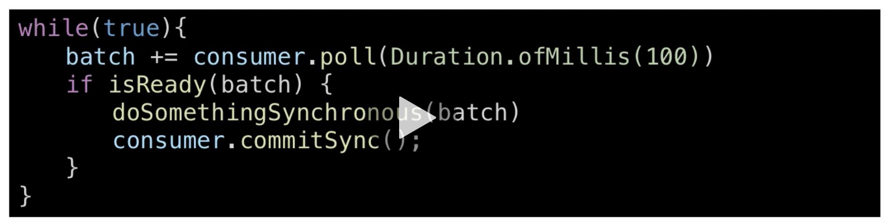
  
> You control when you commit offsets and what is the condition for committing them
> Example : accumulating record into buffer and then flushing the buffer to a database + committing the offsets then

## Consumer Offset Reset Behaviour
* A consumer is expected to read the data from a log continuously

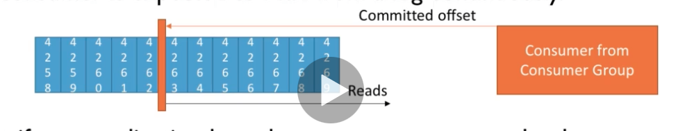

* But if your application has a bug, your consumer can be down
* If Kafka has a retention of 7 days, and your consumer is down for more than 7 days, the offsets are `invalid`›

* Consumer behaviour

`auto.offset.reset=latest`: Will read from the end of the log

`auto.offset.reset=earliet`: will read from the start of the log

`auto.offset.reset=none`: will throw exception if no offset is found

* Consumer offset can be lost
> if a consumer hasn't read new data in 1 day (Kafka < 2.0)
> If a consumer hasn't read the new data in 7 days (Kafka >= 2.0)
 
* This can be controlled by broker setting `offset.retention.minutes`

## Replaying data for Consumer
* To replay data for a consumer group:
> Take all the consumers down
> Use `kafka-consumer-group` command to set offset to what you want.
> restart consumer

## Recommendation
* Set proper data retention period & offset retention period
* Ensure the auto offset reset behaviour is the one you expect / want
* Use replay capability in case of unexpected behavior

## Producers: Message keys

  * Producer can choose to send a `key` with the message (string, number,etc ...)
  * If key=null, data is sent round robin (broker 101 then 102 then 103 ...)
  * If a key is sent, then all messages for that key will always go to the same partition
  * A key is basically sent if you need message ordering for a specific field (ex: truck_id)

  >Advanced: we get this guarantee thanks to key hashing, which depends on the number of partitions
## Consumer
* Consumers read data from a topic (identified by name)
* Consumers know which broker to read from
* In case of broker failures, consumers know how to recover
* Data is read in order `within each partitions`

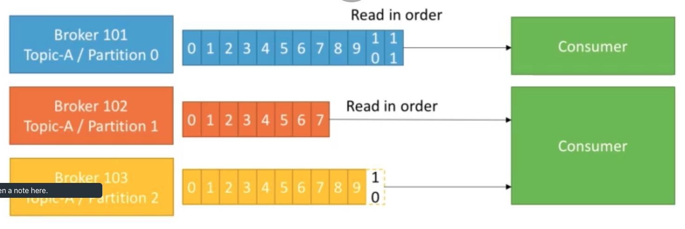

## Producer Retries
* In case of transient failures, developers are expected to handle exceptions, otherwise the data will be lost
* Example of transient failure: `NotEnoughReplicasException`
* There is a `retries` setting
  > defaults to 0 for Kafka <= 2.0
  > defaults to 214748383647 for Kafka >= 2.1
   
* The `retry.backoff.ms` settings is by default 100 ms

## Producer Timeout
* If retries > 0 , for example retries=2147483647
* the producer won't try the request forever, it's bounded by a timeout
* For this, you can set an intuitive Producer Timeout (KIP-91 - Kafka 2.1)
* `delivery.timeout.ms=120000 ms == 2 minutes`
* Records will be failed if they can't be acknowledged in `delivery.timeout.ms`

## Producer Retries : Warning

* In case of retries, there is a chance that messages will be sent out of order (if a batch has failed to be sennt)
* If you rely on key-based ordering, that can be an issue
* For this, you can set the setting while controls how many producer requests can be made in parallel: `max.in.flight.requests.per.connection`
 > default: 5, set it to 1 if you need to ensure ordering (may impact throughput)
* In Kafka >= 1.0.0, there is a better solution with idempotent producers.

## Idempotent Producer
> Here is the problem: the Producer can introduce duplicate messages in the Kafka due to the network errors
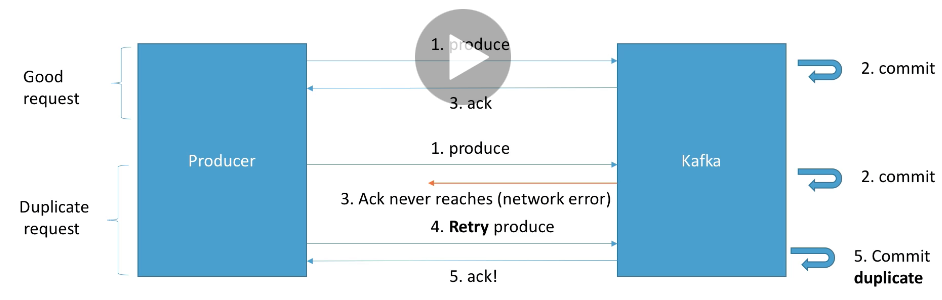
> Idempotent Producer is implemented since `producer >= 0.11 and kafka >= 0.11`
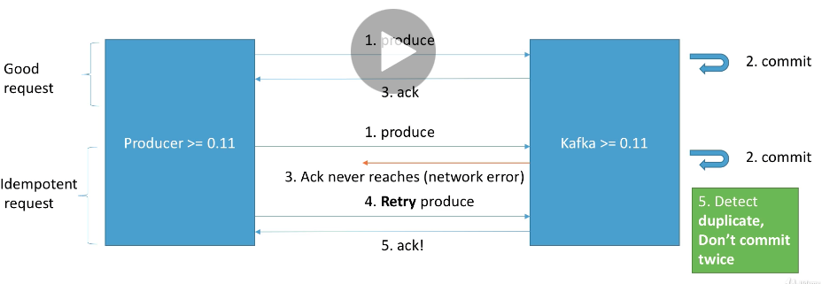
> Basically, in kafka >= 0.11, you can define a `idempotent producer` which won't introduce duplicates on network error
> Idempotent producers are great to guarantee a stable and safe pipeline
> They come with:
  * retries = Integer.MAX_VALUE
  * max.in.flight.requests=1 (Kafka == 0.11) or
  * max.in.flight.requests=5 (Kafka >= 1.0 - higher performance and keep ordering)
    (ticket KAFKA-5494)
    
> These settings are applied automatically after your producer has started if you do not set them manually
> Just set: 
  ```shell
  producerProps.put("enable.idempotence", true)
  ```
## Safe Producer
**Kafka < 0.11**
* acks=all (producer level)
> ensures data is properly replicated before an ack is received
* `min.insync.replicas=2` (broker/topic level)
> ensures two brokers in ISR at least have the data after an ack
* `retries=MAX_INT` (producer level)
> ensures transient errors are retried indefinitely
* `max.in.flight.requests.per.connection=1` (producer level)
> ensures only one request is tried at any time, preventing message re-ordering in case of retries

**Kafka >= 0.11**
* `enable.idempotence=true` (producer level) + `min.insync.replicas=2` (broker/topic level)
> Implies `acks=all,retries=MAX_INT,max.in.flight.requests.per.connection=1 (if Kafka 0.11 or 5 if Kafka >=1.0`, while keeping ordering guarantees and improving performance!
* Running a `safe producer` might impact throughput and latency, always test for your use case.
## Improve Kafka producer
Example config
```shell
        acks = 1
        batch.size = 16384
        bootstrap.servers = [127.0.0.1:9092]
        buffer.memory = 33554432
        client.dns.lookup = use_all_dns_ips
        client.id = producer-1
        compression.type = none
        connections.max.idle.ms = 540000
        delivery.timeout.ms = 120000
        enable.idempotence = false
        interceptor.classes = []
        internal.auto.downgrade.txn.commit = false
        key.serializer = class org.apache.kafka.common.serialization.StringSerializer
        linger.ms = 0
        max.block.ms = 60000
        max.in.flight.requests.per.connection = 5
        max.request.size = 1048576
        metadata.max.age.ms = 300000
        metadata.max.idle.ms = 300000
        metric.reporters = []
        metrics.num.samples = 2
        metrics.recording.level = INFO
        metrics.sample.window.ms = 30000
        partitioner.class = class org.apache.kafka.clients.producer.internals.DefaultPartitioner
        receive.buffer.bytes = 32768
        reconnect.backoff.max.ms = 1000
        reconnect.backoff.ms = 50
        request.timeout.ms = 30000
        retries = 2147483647
        retry.backoff.ms = 100
        sasl.client.callback.handler.class = null
        sasl.jaas.config = null
        sasl.kerberos.kinit.cmd = /usr/bin/kinit
        sasl.kerberos.min.time.before.relogin = 60000
        sasl.kerberos.service.name = null
        sasl.kerberos.ticket.renew.jitter = 0.05
        sasl.kerberos.ticket.renew.window.factor = 0.8
        sasl.login.callback.handler.class = null
        sasl.login.class = null
        sasl.login.refresh.buffer.seconds = 300
        sasl.login.refresh.min.period.seconds = 60
        sasl.login.refresh.window.factor = 0.8
        sasl.login.refresh.window.jitter = 0.05
        sasl.mechanism = GSSAPI
        security.protocol = PLAINTEXT
        security.providers = null
        send.buffer.bytes = 131072
        ssl.cipher.suites = null
        ssl.enabled.protocols = [TLSv1.2, TLSv1.3]
        ssl.endpoint.identification.algorithm = https
        ssl.engine.factory.class = null
        ssl.key.password = null
        ssl.keymanager.algorithm = SunX509
        ssl.keystore.location = null
        ssl.keystore.password = null
        ssl.keystore.type = JKS
        ssl.protocol = TLSv1.3
        ssl.provider = null
        ssl.secure.random.implementation = null
        ssl.trustmanager.algorithm = PKIX
        ssl.truststore.location = null
        ssl.truststore.password = null
        ssl.truststore.type = JKS
        transaction.timeout.ms = 60000
        transactional.id = null
        value.serializer = class org.apache.kafka.common.serialization.StringSerializer
```
## Message Compression
* Producer usually send data in text-based, for example with JSON data
* In this case, it is important to apply compression to the producer
* Compression is enabled at the Producer level and does not require any configuration change in the Broker or in the Consumer
* `compression.type` can be `none`, (default), `gzip`, `lz4`, `snappy`
* Compression is more effective for the bigger batch of message being sent to Kafka

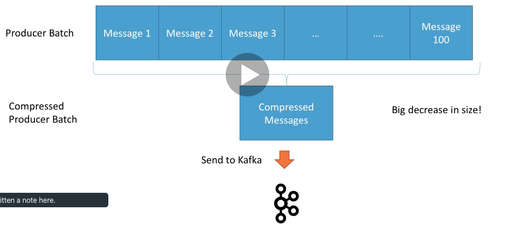

* The compressed batch has the following advantages:
  > Much smaller producer request size (compression ratio up to 4x!)
  > Faster to transfer data over the network => less latency
  > Better throughput
  > Better disk utilization in Kafka (stored message on disk are smaller)
   
* Disadvantages (very minor)
  > Producers must commit some CPU cycles to compress
  > Consumer must commit some CPU cycles to decompress
  
* Overall
  > Consider testing snappy or lz4 for optimal speed / compression ratio
   
* Best Practice
  > Find a compression algorithm that gives you the best performance for your specific data. Test all if them !
  > Always use compression in production and especially if you have high throughput
  > Consider tweaking `linger.ms` and `batch.size` to have bigger batches and therefore more compression and higher throughput

## linger.ms & batch.size
* By default, Kafka tries to send records as soon as possible
  > it will up to 5 request in flight, meaning up to 5 messages individually sent at the same time
  > After this, if more messages have to be sent while others are in flight, Kafka is smart and will start batching them while they wait to send them all at once
  
* This smart batching allows Kafka to increase throughput while maintaining very low latency.
* Batches have higher compression ratio so better efficiency
* So how can we control the batching mechanism?

`linger.ms`
* number of milliseconds a producer is willing to wait before sending a batch out (default 0)
* By introducing some lag (for example linger.ms=5), we increase the chances of messages being sent together in a batch
* So at the expense of introducing a small delay, we can increase throughput, compression and efficiency of our producer
* If a batch is full (see batch.size) before the end of the linger.ms period, it will be sent to Kafka right away.
  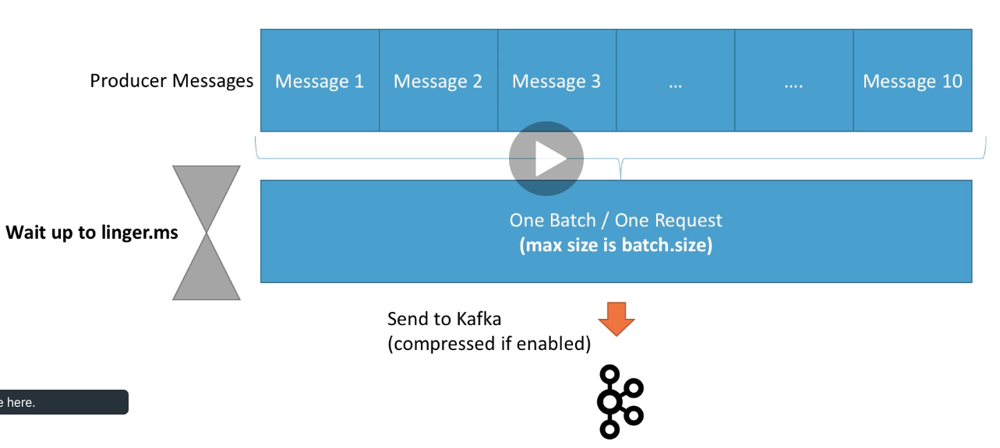
  
`batch.size`
* Maximum number of bytes that will be included in a batch. The default is 16KB
* Increasing a batch size to something like 32KB or 64KB can help increasing the compression, throughput, and efficienct request
* Any message that is bigger than batch size will noht be batched.
* A batch is allocated per partitiion, so make sure that you don't set if to a number that is too high, otherwise you will run waste memory.
* `Kafka producer metrics` is used to monitor the average batch of size.

## High throughput Producer
* We will add snappy message compression in our producer
* snappy is very helpful if your messages are text based, for example log lines or JSON document
* snappy has a good balance between of CPU and compression ratio
* We will also increase the batch.size to 32KB and introduce a small delay through linger.ms (20 ms)

## Producer Default Partitioner and How keys are hashed
* By default your keys are hashed using the `murmur2` algorithm.
* It is most likely preferred to not override the behavior of the practitioner, but it is possible to do so (partiioner.class)
* The formula is:
```shell
targetPartition = Utils.abs(Utils.murmur2(record.key()))% numPartitions
```
* This means that the same key will go to the same partition (we already know this), and adding partitions to a topic will completely alter the formula

## Consumer Groups

* Consumers read data in consumer groups
* Each consumer within a group reads from exclusive partitions
* If you have more consomers than partitions, some consumers will be inactive
> Consumers will automatically user GroupCoordinator and a ConsumerCoordinator to assign a consumers to a partition.

## Consumer Offsets

* Kafka stores the offsets at which a consumer group has beed reading
* The offsets committed live in a Kafka topic named `__consumer_offsets`
* When a consumer in a agroup has processed data received from Kafka, it should be committing the offsets
* If a consumer dies, it will be able to read back from where it left off. Thanks to the committed consumer offsets.

## Delivery semantics for consumers

* At most once:
> offset are committed as soon as the message received
> If the processing goes wrong, the message will be lost (it won't read again)

  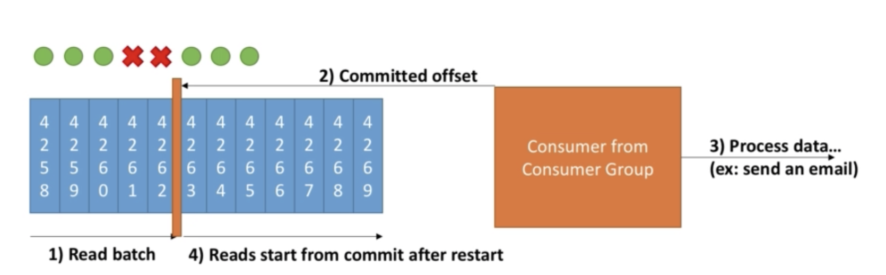

* At lease once
> Offsets are committed after the message is processed
> if the processing goes wrong, the message will be read again
> This can result in duplicate processing message. Make sure your processing is idempotent
> processing again the message will not impact the system
  
  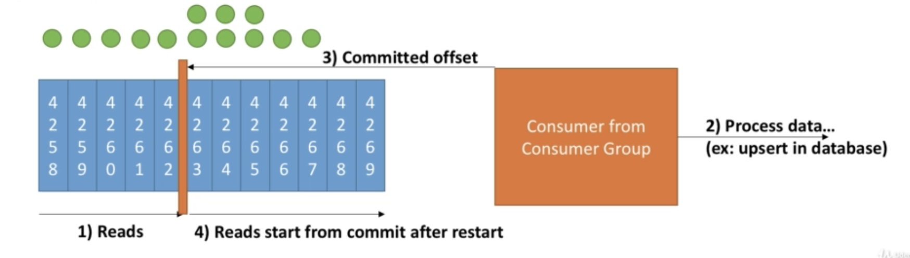
   
* Exactly once
> Can be achieved for Kafka -> Kafka

## Zookeeper

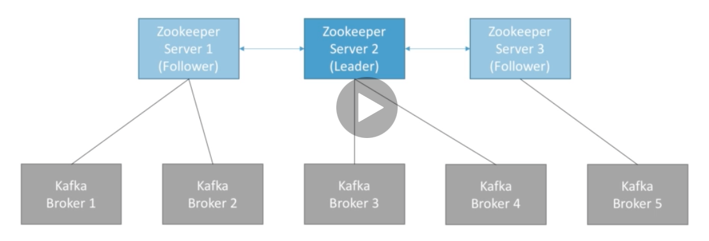

* Zookeeper manages brokers (keep a list of them)
* Zookeeper helps in performing leader election for partitions
* Zookeeper sends notifications to Kafka in case of changes (e.g. new topic, broker dies broker comes up, delete topics, etc)
* **Kafka cannot work without Zookeeper**
* Zookeeper by design operates with an odd number of servers (3,5,7,...)
* Zookeeper has a leader (handle writes) the rest of the servers are followers (handle reads)
* Zookeeper does not store the consumer offsets with Kafka > v.0.10

## Kafka Guarantees

* Messages are appended to a topic-partition in the order they are sent
* Consumers read messages in the order stored in a topic partition
* With a replication factor N, producers and consumers can tolerate up to N-1 brokers being down
* This is why a replication factor of 3 is a good idea:
 > Allows for one broker to be taken down for maintenance
 > Allows for another broker to be taken down unexpectedly
* As long as the number of partitions remains constant for a topic (no new partitions), the same key always go to the same partition

## Roundup

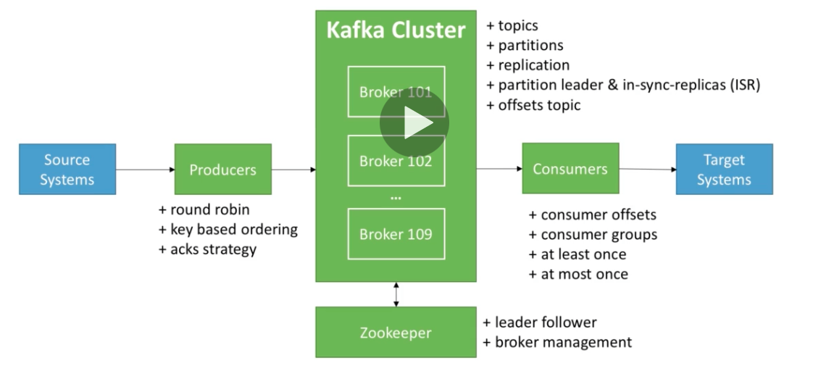

## Hand-ons
`create topic`

```shell
kafka-topics --zookeeper 127.0.0.1:2181 --topic-name twitter_tweets --partitions 6 --replication-factor 1
```
`list topic`

```
kafka-topics --zookeeper 127.0.0.1:2181 --list

```

`zookeeper`

```shell
zookeeper-server-start zookeeper.properties
```

`kafka`

```
kafka-server-start server.properties
```

`kafka console producer`

```
kafka-console-producer --broker-list 127.0.0.0:9092 --topic first_topic
```

`kafka console consumer`

```shell
```
# Kafka rides Camel-k

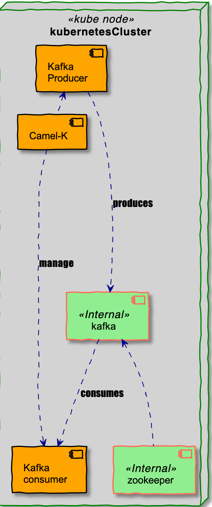


`Prerequisites`

`kafka` and camel-k in minikube installed

## camel-k as consumer client

```java
from("kafka:<topic_name>?brokers=<broker-host>:<port>&groupId=<consumer_group_id>&clientId=<client_id>&seekTo=beginning&valueDeserializer=org.apache.kafka.common.serialization.ByteArrayDeserializer")
                .process(exchange -> {
                    //business logic
                    }
                });

```

## camel-k as producer client

```java
from("timer:java?period=60000")
        .setHeader(KafkaConstants.KEY, constant("Camel")) // Key of the message
        .setBody()
        .simple("Hello "+ UUID.randomUUID())
        .to("kafka:first_topic?brokers=kafka-broker:9092");
```

## Docker

```shell

```


 


